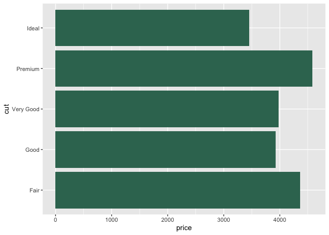
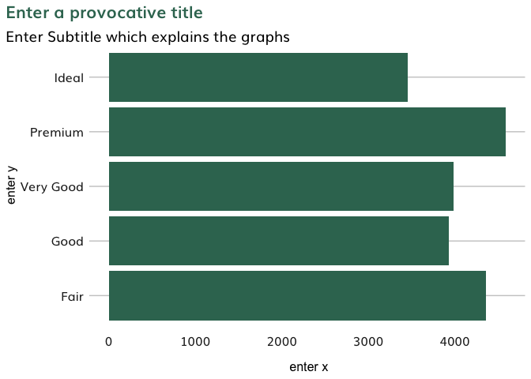

README
================
Rishabh Kumar
30/05/2020

# dectechViz

An R package to to make your graphs prettier quickly. This is still a
work in progress so bear with me.

``` r
library(ggplot2)
```

    ## Warning: package 'ggplot2' was built under R version 3.6.2

``` r
p1 <- ggplot(diamonds, aes(price, cut)) + geom_bar(stat = "summary", fun.x = "mean" )
```

    ## Warning: Ignoring unknown parameters: fun.x

``` r
p1
```

    ## No summary function supplied, defaulting to `mean_se()`

<!-- -->

``` r
remotes::install_github("rishkum/dectechViz")
```

    ## Skipping install of 'dectechViz' from a github remote, the SHA1 (0e07735b) has not changed since last install.
    ##   Use `force = TRUE` to force installation

``` r
library(dectechViz)
```

    ## 
    ## Attaching package: 'dectechViz'

    ## The following object is masked _by_ '.GlobalEnv':
    ## 
    ##     p1

``` r
p2 <- ggplot(diamonds, aes(price, cut)) + geom_bar(stat = "summary" ,fill = dectech_cols("dectech green"))
p2
```

    ## No summary function supplied, defaulting to `mean_se()`

<!-- -->

``` r
p2 <- ggpretay(p2)
p2
```

    ## No summary function supplied, defaulting to `mean_se()`

<!-- -->

``` r
library(gridExtra)
grid.arrange(p1, p2, ncol = 2)
```
