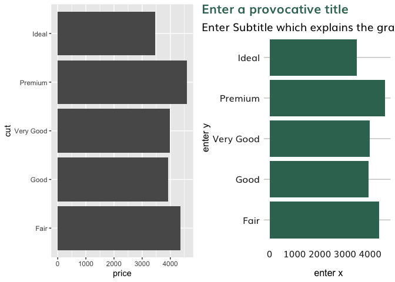

README
================
Rishabh Kumar
30/05/2020

## dectechViz

An R package to to make your graphs prettier quickly. This is still a
work in progress so bear with me.

``` r
library(ggplot2)
p1 <- ggplot(diamonds, aes(price, cut)) + geom_bar(stat = "summary", fun.x = "mean" )
p1
```

<!-- -->

``` r
remotes::install_github("rishkum/dectechViz")
library(dectechViz)
p2 <- ggplot(diamonds, aes(price, cut)) + geom_bar(stat = "summary" , fill = dectech_cols("dectech green"))
p2
```

<!-- -->

Finally you will get

``` r
p2 <- ggpretay(p2)
p2
```

<!-- -->

## See the difference\!

<!-- -->
